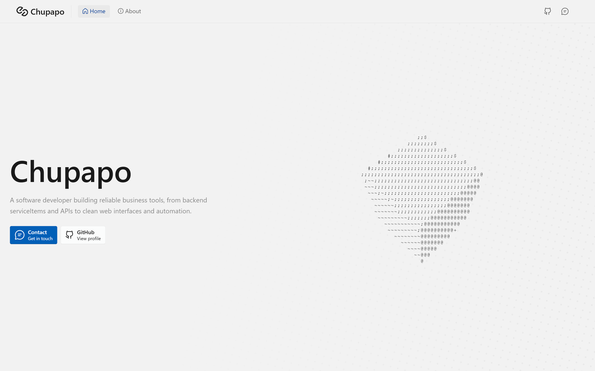

<h1 align="center">
  Chupapo Website
</h1>

<p align="center">
  <a href="https://chupapo.com/">chupapo.com</a>
</p>

This repository contains the source code for my personal website, created to present my custom **software development services** and introduce myself.

## Preview


## Built With

- React
- Vite
- JavaScript
- HTML
- CSS

## Installation
To run this project locally:

**1. Clone the repository**
```bash
git clone https://github.com/chapeullah/website.git
```
**2. Go to the project directory**
```bash
cd website
```
**3. Install dependencies**
```bash
npm install
```
**4. Start the development server**
```bash
npm run dev
```
